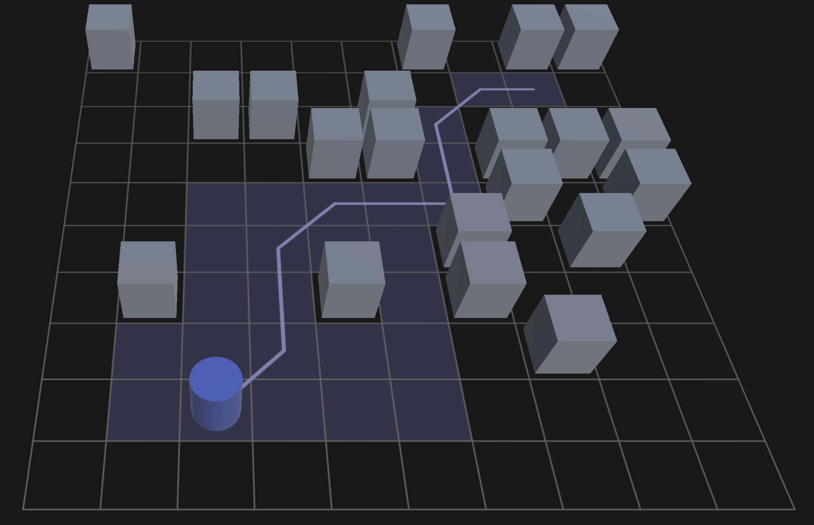
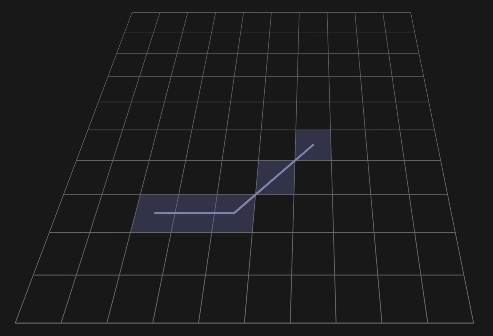
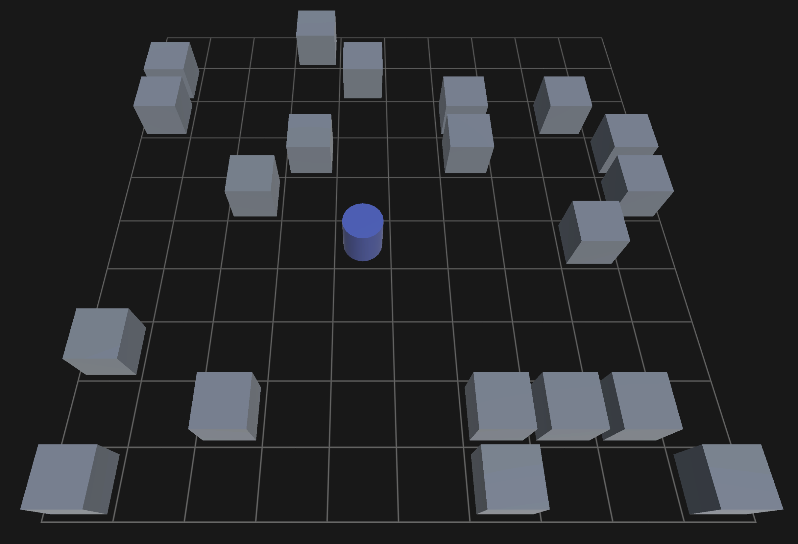
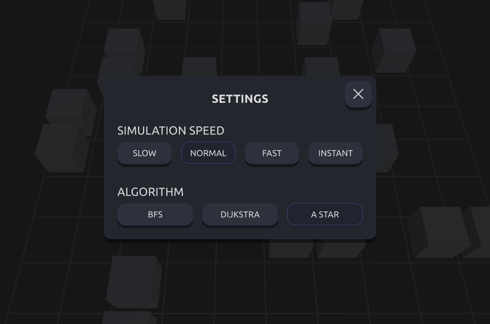

## Pathfinding Algorithms Visualizer

This repository contains a **Unity-based application for visualizing pathfinding algorithms** on a square grid.  
The project demonstrates how BFS, Dijkstra, and A* explore tiles and construct paths, with execution visualized step by step using custom shaders and a custom UI framework.

The project was created to **analyze and compare algorithm behavior**, node expansion order, and path construction in a controlled grid environment.

*pathfinding execution and path construction*  

#### Main scene directory:
Assets/Scenes/Start.unity

---

#### Algorithms

The project includes three pathfinding algorithms:

- **Breadth-First Search (BFS)**  
  Explores the grid uniformly. Guarantees the shortest path in unweighted grids.

- **Dijkstra**  
  Expands nodes by accumulated traversal cost. Guarantees the optimal path.

- **A\***  
  Uses accumulated cost and heuristic distance to reduce explored nodes.

Each algorithm visualizes:
- tile exploration order
- final computed path

---

#### Visualization and Rendering

Pathfinding execution is visualized using two elements:

- **Visited Tiles**  
  Displayed in the order processed by the algorithm.

- **Final Path**  
  Rendered after reaching the target and animated separately.

Rendering is handled using **three custom shaders**:

- Grid shader – renders the square grid  
- Visited tiles shader – visualizes explored nodes  
- Path shader – renders and animates the final path  

This approach replaces default Unity rendering and allows precise control over visualization timing.

*shader visualization*  

---

#### User Interaction

- **Left Mouse Button (first click)** – Select target tile and start pathfinding  
- **Left Mouse Button (second click on same tile)** – Move agent along the computed path  
- **Shuffle** – Randomize obstacles and agent position  
- **Settings** – Change algorithm and simulation speed  

---

#### Obstacles Layout

Each shuffle generates a **new obstacle configuration**, affecting traversal and algorithm behavior.  
Obstacle placement is randomized on reset, allowing repeated testing on different layouts.

*example obstacle layout*  

---

#### Settings

The application provides runtime configuration options:

- Pathfinding algorithm selection  
- Simulation speed presets  

*settings panel*  

---

#### Custom UI Framework

All UI elements are built using a **custom Unity UI framework**, developed as a separate package:

https://github.com/jakub-wegner/UIEngine

The framework provides reusable components and state-based interaction handling without relying on Unity’s built-in UI system.

---

#### Web Version

The project is also exported as a **WebGL build** and playable in a browser.

https://jakub-wegner.itch.io/pathfinding-visualizer

---

#### Technologies

- Unity  
- C#  
- HLSL  
- Universal Render Pipeline (URP)  
- WebGL  
